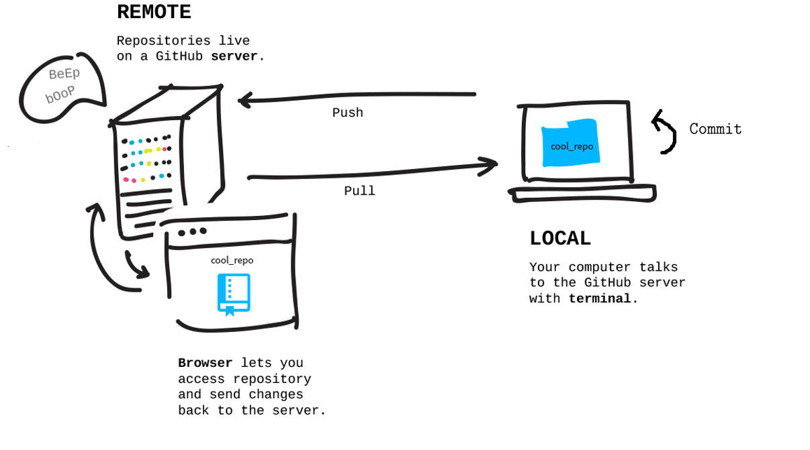

# Introduction to version Control in R with RStudio, Git, and Github

## About this work

This work was originally created by [Mike Croucher](https://github.com/mikecroucher) from [RSE-Sheffield](https://github.com/RSE-Sheffield) under a [Creative Commons Attribution Share Alike 4.0 International](https://creativecommons.org/licenses/by-sa/4.0/legalcode). The overview image is from [Dumitru Uzun](https://duzun.me/tips/git). You are free to use this work in your own projects. 

## Overview of the exercice  
In this session, you are going to start using the version control system Git from within RStudio to keep your local workflow tidy while having access to all previous versions of your files. You will then backup your workflow online on a remote GitHub server, which will allow you to access your work from any computer, and sharing it with your collaborators or publically. Specifically, you will  
* install and configure Git (as well as R and RStudio if needed), and create a GitHub account  
* create a local RStudio project under version control  
* make changes and **commit** them to your local repository (i.e. save your changes locally in your version control system)  
* connect your local repository to your GitHub account by creating a remote GitHub repository and setting it as the 'origin' of your local repository from the command line (this is the procedure you will have to follow to 'upgrade' your former RStudio projects that were not under version control and backed-up on GitHub; but in the future, I recommend you first create a GitHub repository (your remote origin) and then **clone** it locally (i.e. copy it to your computer while maintaining a connection to your remote (GitHub) version). This procedure, easily done from RStudio, will be covered in the [second workshop](https://github.com/MalikaIhle/Collaborative-RStudio-GitHub))  
* **push** your local changes to your remote repository (i.e. synchronise your changes to your GitHub version)  

Once this workflow is set up, you can easily work with several computers or with collaborators: if you have changes in your GitHub version (if you or a collaborator pushed changes from another computer or if you made changes online, directly on GitHub), you can **pull** them into your local version (i.e fetch changes and merge them locally, to keep your copy up-to-date).

 
  
 

## Step-by-step tutorial
The material is self-paced and includes a worked-example. It is suggested that you work through the sections in order.  

* [Installing the software](./installing_software.md) - Get what you need on your own machine
* [Getting an account on github](./github.md) - Sign up for github
* [Creating an RStudio project](./rstudio_project.md) - Creating an example, version controlled project
* [Starting our analysis project](./analysis_start.md) - A simple script to get us started
* [Getting our project under version control](./version_control.md) - First step into a larger world
* [Making a change](./making_change.md) - Making our script more useful
* [Committing our change](./commit.md) - How to commit a change
* [Connecting our local repository to GitHub](./github_sync.md) - Backup! Making our code available to the world.
* [Subsequent updates](./updates.md) - Now we are set up, the workflow is easy.
* [The example repo](./created_earlier.md) - My version of the repo we've created today
* [Things we haven't told you](./next_steps.md) - Steps to further learning
