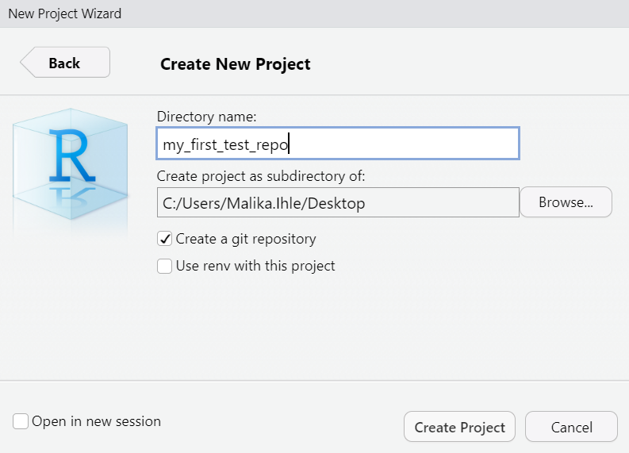
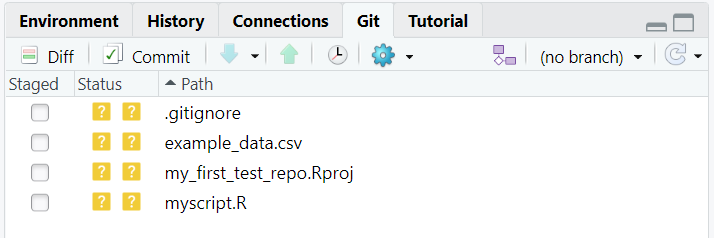
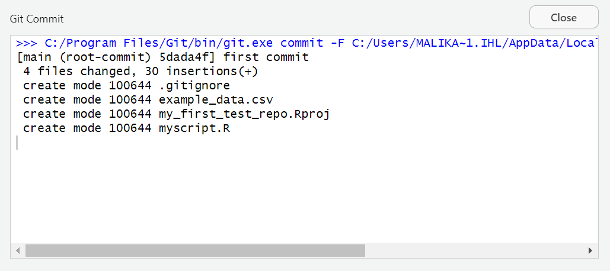

# ISBE Symposium - Introduction to Reproducible Research in R and R Studio.

## Version control with git and github

## Installing R, RStudio and git

Many users of R use it from within another free piece of software called **RStudio.**
RStudio is a powerful and productive user interface for R. It’s free and open source, and works great on Windows, Mac, and Linux.

Rstudio's version control functionality is provided by yet another software called **git**

Our first task, therefore, is to install R, RStudio and git.

**Install R**

Install R first. Downloads are available at https://cran.rstudio.com/
  * Direct link for Windows https://cran.r-project.org/bin/windows/base/
  * Direct link for MacOS X https://cran.r-project.org/bin/macosx/
  * Direct link for Linux https://cran.r-project.org/bin/linux/

**Install RStudio**

Next, install RStudio.

* Downloads are available at https://www.rstudio.com/products/rstudio/download/

**Install git**

Git is one of the most popular version control systems in the world. It is free and open source.

* Windows & OS X: http://git-scm.com/downloads
* Debian/Ubuntu: `sudo apt-get install git-core`
* Fedora/RedHat: `sudo yum install git-core`

**Configure git**

After installing git, you need to tell it who you are. Open a terminal window (**cmd.exe on windows**) and type the following

```
git config --global user.email "you@youremail.com"
git config --global user.name "Your Name"
```

# Create account on github

Although git can be used on its own, most people choose to use it in conjunction with an online repository service. The most popular of these, by far, is github.

It has become so standard that some organisations will ask to see your github profile as part of job applications!

* Create a free account on github. **If you have an academic email account you should use it here.**
    * https://github.com/join

Github users can create an unlimited number of free, **public** repositories. If you want to create **private** repositories, most people need to purchase a subscription.

**Academic users can get access to an unlimited number of free private repositories.**  The key to these riches is your academic email address which has to be associated with your github account.

* If you are an academic, request free private repositories - https://education.github.com/discount_requests/new

# Create an RStudio project

A project is a folder that contains everything concerning your analysis and may include code, data and documentation. It is a complete research object that can be used to describe and reproduce your research.

Create a new project as follows:

**File** -> **New Project** -> **New Directory**


In the **Project Type** screen, click on **Empty Project**.


In the **Create New Project** screen, give your project a name and ensure that **create a git repository** is checked. Click on **Create Project**.



RStudio will create a new folder containing an empty project and set R's working directory to within it.

TODO: Describe the files created by the project.

**Building our analysis project**

To get used to the version control workflow, we are going to download and plot some data. Later we'll fit a curve to it.

Download this data to your project folder: [Example data](https://raw.githubusercontent.com/mikecroucher/Code_cafe/master/First_steps_with_R/example_data.csv) (right click and use your Web browser's save as functionality).

Create a new R script in RStudio. **File** -> **New File** -> **R script**

Enter the following commands into your new RScript

```
mydata = read.csv("example_data.csv")
plot(mydata$xdata,mydata$ydata)
```

Save the R Script as `myscript.R`. When you run it, it should load and plot the data.

Your directory should now contain 4 files:


**Getting our project under version control**

We now have the first version of our analysis so let's get it under version control. By default, the git version control pane is in the top right hand corner of RStudio. Find it and click on the **git** tab.



If you hover the mouse pointer over the yellow ? marks, you'll see a tooltip telling us that the file is **untracked**. This means that git is not tracking versions of this file.

Tick **staged** for each file.


All of our files are now **staged**, ready for the first **commit**. Click on the **commit** button


Details of the commit will appear in the next pane. You need to specifiy a **commit message** -- something descriptive about the changes you've made. Since this is our first commit, we can simply say that.

Once you've typed a commit message, click on **Commit** and you're done.


The following messages from git will shown.




# Publish your code and get a DOI - Zenodo
