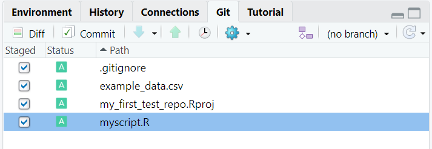
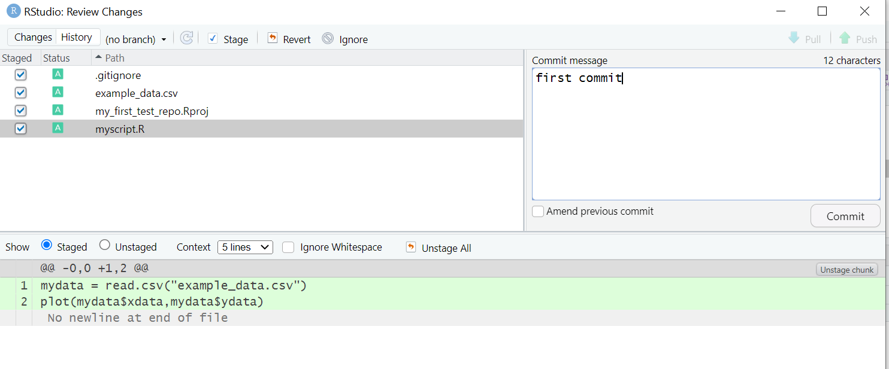
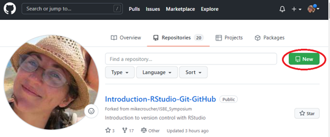
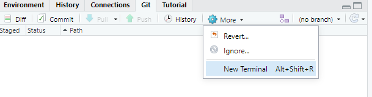
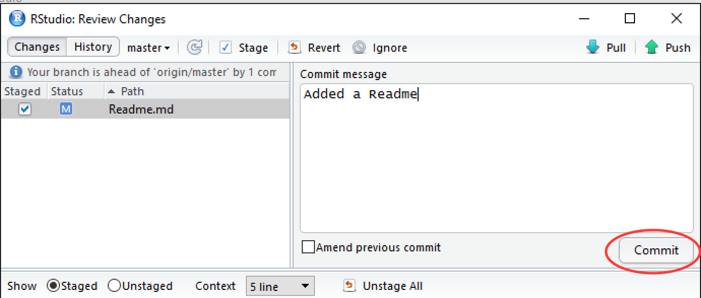

# ISBE Symposium - Introduction to Reproducible Research in R and R Studio.

## Version control with git and github

## Installing R, RStudio and git

Many users of R use it from within another free piece of software called **RStudio.**
RStudio is a powerful and productive user interface for R. It’s free and open source, and works great on Windows, Mac, and Linux.

Rstudio's version control functionality is provided by yet another software called **git**

Our first task, therefore, is to install R, RStudio and git.

**Install R**

Install R first. Downloads are available at https://cran.rstudio.com/
  * Direct link for Windows https://cran.r-project.org/bin/windows/base/
  * Direct link for MacOS X https://cran.r-project.org/bin/macosx/
  * Direct link for Linux https://cran.r-project.org/bin/linux/

**Install RStudio**

Next, install RStudio.

* Downloads are available at https://www.rstudio.com/products/rstudio/download/

**Install git**

Git is one of the most popular version control systems in the world. It is free and open source.

* Windows & OS X: http://git-scm.com/downloads
* Debian/Ubuntu: `sudo apt-get install git-core`
* Fedora/RedHat: `sudo yum install git-core`

**Configure git**

After installing git, you need to tell it who you are. Open a terminal window (**cmd.exe on windows**) and type the following

```
git config --global user.email "you@youremail.com"
git config --global user.name "Your Name"
```

# Create an account on github

Although git can be used on its own, most people choose to use it in conjunction with an online repository service. The most popular of these, by far, is github.

It has become so standard that some organisations will ask to see your github profile as part of job applications!

* Create a free account on github. **If you have an academic email account you should use it here.**
    * https://github.com/join

Github users can create an unlimited number of free, **public** repositories. If you want to create **private** repositories, most people need to purchase a subscription.

**Academic users can get access to an unlimited number of free private repositories.**  The key to these riches is your academic email address which has to be associated with your github account.

* If you are an academic, request free private repositories - https://education.github.com/discount_requests/new

# Create an RStudio project

A project is a folder that contains everything concerning your analysis and may include code, data and documentation. It is a complete research object that can be used to describe and reproduce your research.

Create a new project as follows:

**File** -> **New Project** -> **New Directory**


In the **Project Type** screen, click on **Empty Project**.


In the **Create New Project** screen, give your project a name and ensure that **create a git repository** is checked. Click on **Create Project**.


RStudio will create a new folder containing an empty project and set R's working directory to within it.

TODO: Describe the files created by the project.

**Building our analysis project**

To get used to the version control workflow, we are going to download and plot some data. Later we'll fit a curve to it.

Download this data to your project folder: [Example data](https://raw.githubusercontent.com/mikecroucher/Code_cafe/master/First_steps_with_R/example_data.csv) (right click and use your Web browser's save as functionality).

Create a new R script in RStudio. **File** -> **New File** -> **R script**

Enter the following commands into your new RScript

```
mydata = read.csv("example_data.csv")
plot(mydata$xdata,mydata$ydata)
```

Save the R Script as `myscript.R`. When you run it, it should load and plot the data.

Your directory should now contain 4 files:


**Getting our project under version control**

We now have the first version of our analysis so let's get it under version control. By default, the git version control pane is in the top right hand corner of RStudio. Find it and click on the **git** tab.


If you hover the mouse pointer over the yellow ? marks, you'll see a tooltip telling us that the file is **untracked**. This means that git is not tracking versions of this file.

Tick **staged** for each file.



All of our files are now **staged**, ready for the first **commit**. Click on the **commit** button


Details of the commit will appear in the next pane. You need to specifiy a **commit message** -- something descriptive about the changes you've made. Since this is our first commit, we can simply say that.

Once you've typed a commit message, click on **Commit** and you're done.



The following messages from git will shown.


# Making a change

The next version of our code will do a little more. From domain knowledge of the data, we know that a good model for it is the equation **p1\*cos(p2\*xdata) + p2\*sin(p1*xdata)**.

We just need to find the values for the parameters **p1** and **p2**. Add the following code to the end of your R script.

```
# some guesses for the parameters.
p1 = 1
p2 = 0.2

# do the fit
fit = nls(ydata ~ p1*cos(p2*xdata) + p2*sin(p1*xdata), data = mydata, start = list(p1=p1,p2=p2))

#Plot the fitted line
new = data.frame(xdata = seq(min(mydata$xdata),max(mydata$xdata),len=200))
lines(new$xdata,predict(fit,newdata=new))

```

For this version, we are also going to change the command that plots our data. Change the lines

```
plot(mydata$xdata,mydata$ydata)
```

to

```
plot(mydata$xdata,mydata$ydata,col='red')
```

Make sure the code runs before proceeding further.

# Committing our change

Make sure you've saved the script. Now, click on the **git** tab in RStudio. You'll notice that there's only one file listed -- our script -- since that's the only file that's changed.


Click on the staged box to stage our change. Now click on  **Diff** to give a summary of what's changed. Lines that have been added are green. Lines that have been removed are red.


Add a commit message and click on commit


# Viewing history

In the **git** tab of RStudio, click on **diff** and then **History**. You'll see that you can look through every commit you've ever made. This can be extremely useful for finding bugs or looking back to how your model looked a few months ago.

It's not possible to revert back to a previous commit using the RStudio interface. For that, you need to learn some command-line git which is beyond the scope of this session.

# Connecting our local repository to github

Our project is fully version controlled so we have access to a detailed history of every change we've ever made to it. This is a great first step but all of this only exists on our own computers at the moment.

It's time to upload our project to github!

Putting your code on github confers a number of benefits:

* Everything is backed up for you.
* Your project is made available to others. This is a vital part of modern scientific dissemination.
* Github has a range of project management and collaboration tools that work on a per-project basis.
* Your github profile can be used as part of your online-identity.

**Creating a new repository on github**

* Log into github and go to your profile page. On the **repositories** tab, click **New**



At the **Create a new repository** screen, give your repo a name and click **Create Repository**.


The **Quick Setup** screen gives sets of git commands that can be used in various circumstances. We are interested in **…or push an existing repository from the command line**. Copy these commands to the clipboard


In RStudio, navigate to the **git** tab and click on **More -> Shell**



Paste the git commands into the Shell and press Enter to execute them.


Confirm that the project has been uploaded to your git profile.

# Subsequent updates

Once a local repository has been associated with github, it's not necessary to use the command line for subsequent uploads. We'll demonstrate this now by adding a **README.md** file to our project.

On github, the README.md file is special since it is rendered by github and is used by many people as an introduction to the project.

In RStudio, click on **File->New File->Text File**.  Add the following text to the file and save it as **Readme.md**.

```
# My Example Repo

This repo is used to demonstrate github to users of R and R Studio.
```

In the **git** tab of RStudio, the **Readme.md** file should be the only file you see. Stage it as shown below and click **commit**.


Supply a commit message and click commit.



Finally, click **push** to upload to github.


You can see that the standard workflow loop is very quick and simple

* Make your change
* Stage your change
* Commit
* Push to github

# Things we haven't told you
