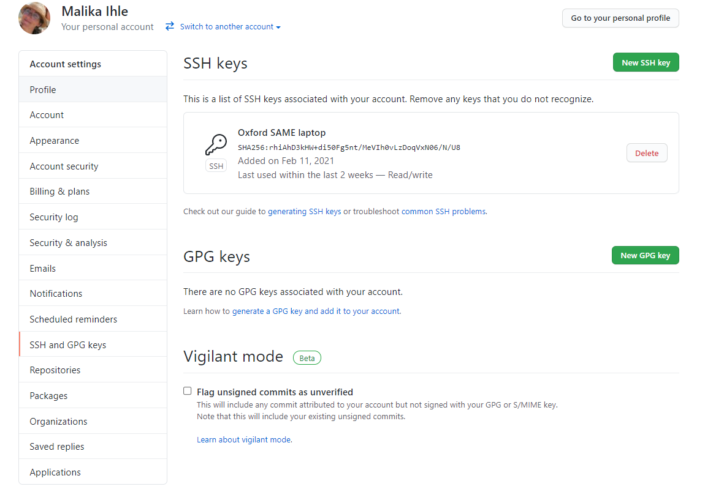
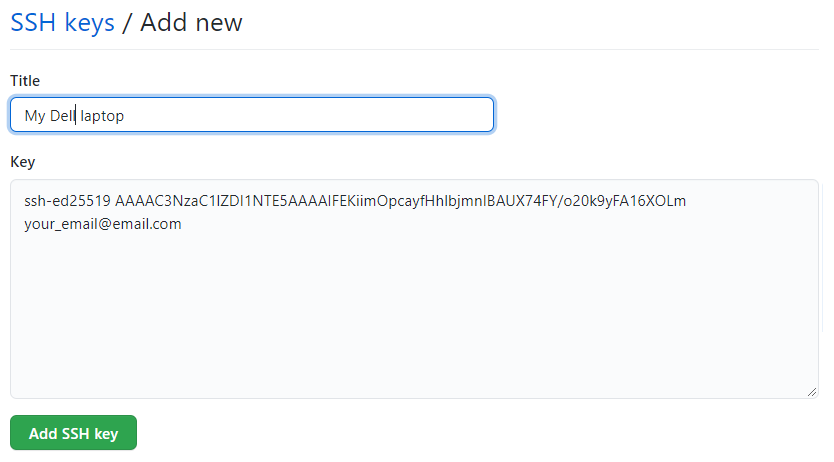

# Secure the connection between your computer and GitHub

When working with a GitHub repository, you'll often need to identify yourself to GitHub using your username and password. There are several ways to secure this connection further. *Establishing a secure connection will be made mandatory by August 13 2021.* 

Today we will use **SSH Keys** to secure your identification to GitHub as this is a common way to secure connections, which you may encounter again in other contexts in the future. An SSH key is also an alternate way to identify yourself that doesn't require you to enter you username and password every time.

SSH keys come in pairs, a public key that gets shared with services like GitHub, and a private key that is stored only on your computer. If the keys match, you're granted access.

The procedure below only need to be executed once per GitHub account and for each computer you will use to connect to GitHub.

## Checking for existing SSH key pair
The first step in using SSH authorization with GitHub is to generate your own key pair. 
However, you might already have an SSH key pair on your machine. You can check to see if one exists by moving to your `.ssh` directory and listing the contents. To do this, open Git Bash (on windows) or the terminal (in Mac or Linux) and type the following (after the dollar prompt)

```
$ cd ~/.ssh
$ ls
```

Check the directory listing to see if you already have a public SSH key. By default, the filenames of the public keys are one of the following:

*id_rsa.pub*  
*id_ecdsa.pub*  
*id_ed25519.pub*  

If you do you, can skip the section that generate a SSH key pair, and go to the section 'Adding a new SSH key to your GitHub account'.  
If you don't have an existing public and private key pair, or if you receive an error that ~/.ssh doesn't exist, go head and generate a new SSH key pair!

## Generating an SSH key pair

In the command line, type the following by replacing your_email@email.com with your own email address.

```
$ ssh-keygen -t ed25519 -C "your_email@email.com"
```

This creates a new SSH key pair, using the provided email as a label.

When you're prompted to "Enter a file in which to save the key," press Enter. This accepts the default file location.

```
Generating public/private ed25519 key pair.  
Enter file in which to save the key (/Users/username/.ssh/id_ed25519):  
```

You will then be asked to provide a passphrase. Protecting your keys with a passphrase is optional but highly recommended. Don't hesitate to use a long passphrase, you'll only have to type it once per day to unlock a key.

```
Enter passphrase (empty for no passphrase):  
Enter same passphrase again:
```

When the key generation is complete, you should see the following confirmation:

```
Your identification has been saved in /Users/username/.ssh/id_ed25519.
Your public key has been saved in /Users/username/.ssh/id_ed25519.pub.
The key fingerprint is:
SHA256:6nr/zo0g7Bz7WMRwy34maBhQy1UZyX47gT+egRdlIhs your_email@email.com
The key's randomart image is:
+--[ED25519 256]--+
|    .o++         |
|   o oF . o      |
|  . o+ =.+.      |
|   .  + += .     |
|    .  +S++      |
|   . ..oB=       |
|    . ++*=.      |
|     o.==* o     |
|    .o.o+** .    |
+----[SHA256]-----+
```


## Adding a new SSH key to your GitHub account

We now need to tell GitHub about your public key. Display the contents of your new public key file with `cat`.  
**Be careful**: do not copy the content of your *private* key, but your *public* key. Your public key ends with `.pub`.

```
$ cat ~/.ssh/id_ed25519.pub
```

The output should look something like this:

```
ssh-ed25519 AAAAC3NzaC1lZDI1NTE5AAAAIFEKiimOpcayfHhlbjmnIBAUX74FY/o20k9yFA16XOLm your_email@email.com
```

Copy the contents of the output to your clipboard.

Login to github.com and bring up your account settings by clicking on your profile photo (top right) and selecting **Settings**. Click on **SSH and GPG keys** (left sidebar), and then click on the green button 'New SSH key' or '**Add SSH key**'.



In the "Title" field, add a descriptive label for the new key. For example, if you're using a personal laptop, you might call this key "Personal MacBook Air". Finally, paste the contents of your clipboard into the Key text box and hit the green 'Add key' button to save. Enter your github password if prompted.



That's it !  
Going forward, you can use the SSH clone URL when copying a repo to your local machine (we will cover this in the second tutorial).

## Adding your key to the ssh-agent (optional)

Read the following to type your passphrase only once.

If you protected your key with a passphrase, you will be prompted
for it every time time you use your key. To save you some typing, it
is possible to use a piece of software called `ssh-agent` to ask your
system to "remember" your key. In practice, this means you only have
to type your passphrase once.

Depending on your system, the following might not be necessary. On
most GNU/Linux distributions, your key will be automatically added to
the `ssh-agent` after the first time you enter it. If you keep getting
asked for your key each time you want to clone or push to a GitHub
repository, you can follow the following instructions.

Start the ssh-agent with

```
$ eval "$(ssh-agent -s)"
```

which should output something like
```
Agent pid 59566
```

Then, add your key to the ssh-agent with

```
ssh-add ~/.ssh/id_ed25519
```

That's it.

***

[Previous](./github.md) | [Next](./rstudio_project.md)

