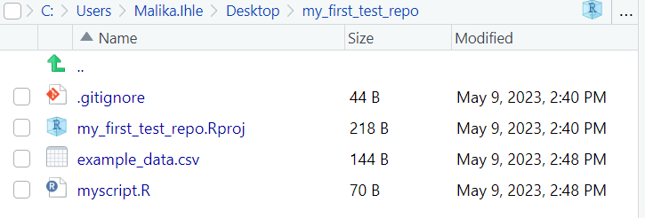

# Starting our analysis project

The purpose of this tutorial is to teach you version control. In order to do this, however, we'll need to make up a simple project that needs controlling!

Our initial project will be extremely simple -- a very small data file and a script that loads and plots it. Later, we'll add code to fit a nonlinear curve to it. (Based on the tutorial at http://www.walkingrandomly.com/?p=5254)

Download this data to your project folder: [Example data](https://raw.githubusercontent.com/RSE-Sheffield/Code_cafe/master/example_data.csv) (right click and use your Web browser's save as functionality. You may need to manually add the file extension ".csv").

Create a new R script in RStudio. **File** -> **New File** -> **R script**

Enter the following commands into your new RScript

```
mydata = read.csv("example_data.csv")
plot(mydata$xdata,mydata$ydata)
```

Save the R Script as `myscript.R`. When you run it, it should load and plot the data.

Your directory should now contain 4 files:

  

[Previous](./analysis_start.md) | [Next](./version_control.md)
