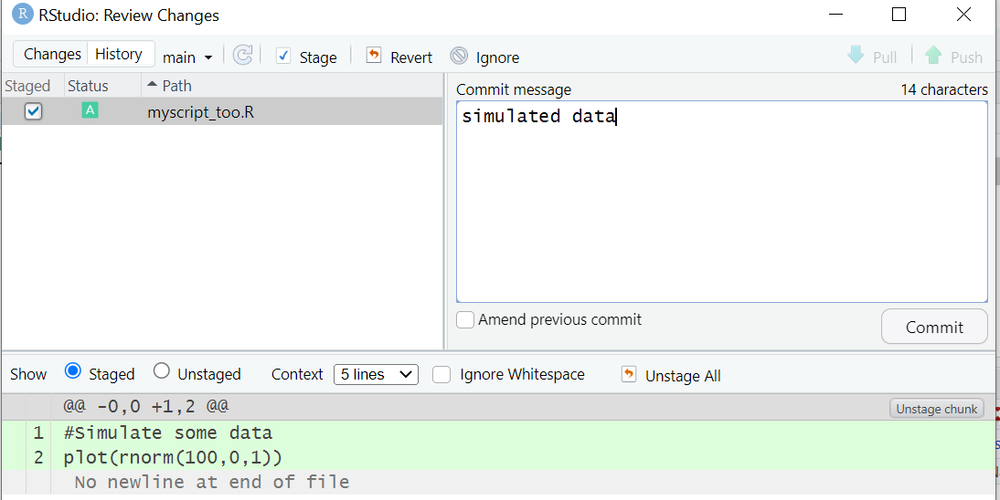

# Committing our change

Now, click on the **git** tab in RStudio. You'll notice that there are two files listed -- our script, which has been modified, and our script too, which was added.

Click on the staged box to stage both our change. Now click on  **Diff** to give a summary of what's changed. Lines that have been added are green. Lines that have been removed are red. You can click on each file names to see changes to each files for this commit.

See that for our first script, from git's point of view, a modification to a line is actually two operations: the removal of the original line followed by the creation of the new line.

Add a commit message and click on commit

Close this window and now stage the second script, commit it with a new message.

***

[Previous](./making_change.md) | [Next](./viewing_history.md)
