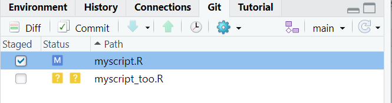
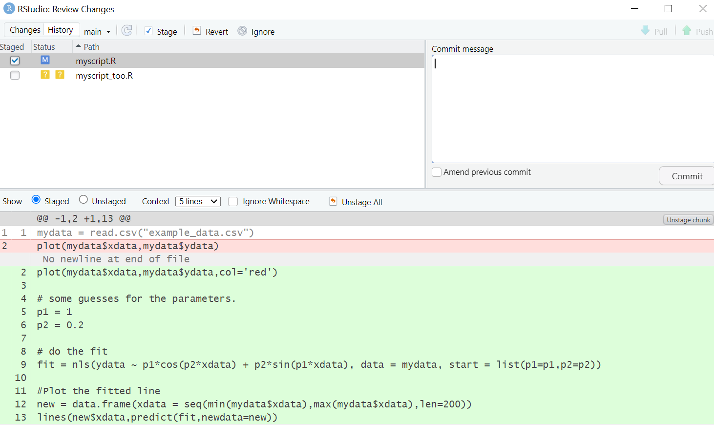
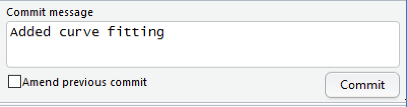

# Committing our change

Make sure you've saved the script. Now, click on the **git** tab in RStudio. You'll notice that there's only one file listed -- our script -- since that's the only file that's changed.

Click on the staged box to stage our change. Now click on  **Diff** to give a summary of what's changed. Lines that have been added are green. Lines that have been removed are red.

From git's point of view, a modification to a line is actually two operations - The removal of the original line followed by the creation of the new line.

Add a commit message and click on commit

# Viewing history

In the **git** tab of RStudio, click on **diff** and then **History**. You'll see that you can look through every commit you've ever made. This can be extremely useful for finding bugs or looking back to how your model looked a few months ago.

It's not possible to revert back to a previous commit using the RStudio interface. For that, you need to learn some command-line git which is beyond the scope of this session.
