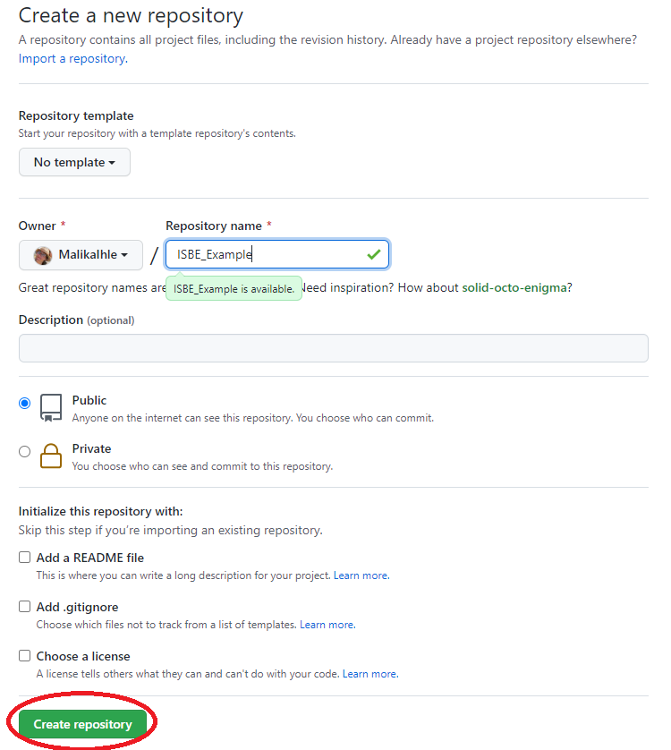
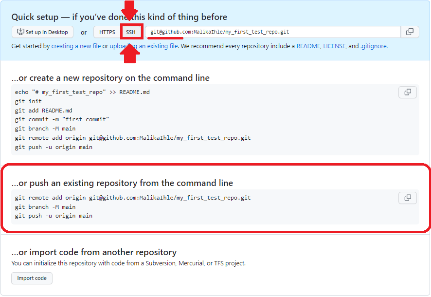
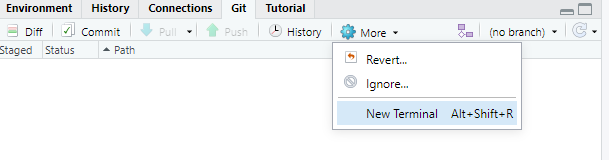
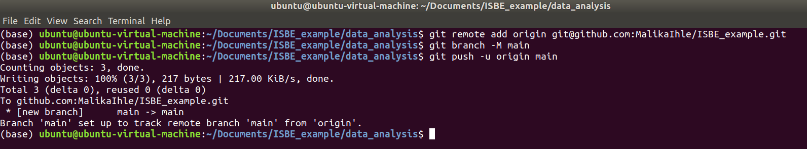

# Connecting our local repository to github

Our project is fully version controlled so we have access to a detailed history of every change we've ever made to it. This is a great first step but all of this only exists on our own computers at the moment.

It's time to upload our project to github!

Putting your code on github confers a number of benefits:

* Everything is backed up for you.
* Your project is made available to others. This is a vital part of modern scientific dissemination.
* Github has a range of project management and collaboration tools that work on a per-project basis.
* Your github profile can be used as part of your online-identity.

**Creating a new repository on github**

* Log into github and go to your profile page. On the **repositories** tab, click **New**

At the **Create a new repository** screen, give your repo a name and click **Create Repository**.

The **Quick Setup** screen gives sets of git commands that can be used in various circumstances. We are interested in **…or push an existing repository from the command line**. Copy these commands to the clipboard

In RStudio, navigate to the **git** tab and click on **More -> Shell**

Paste the git commands into the Shell and press Enter to execute them.

Confirm that the project has been uploaded to your git profile.
