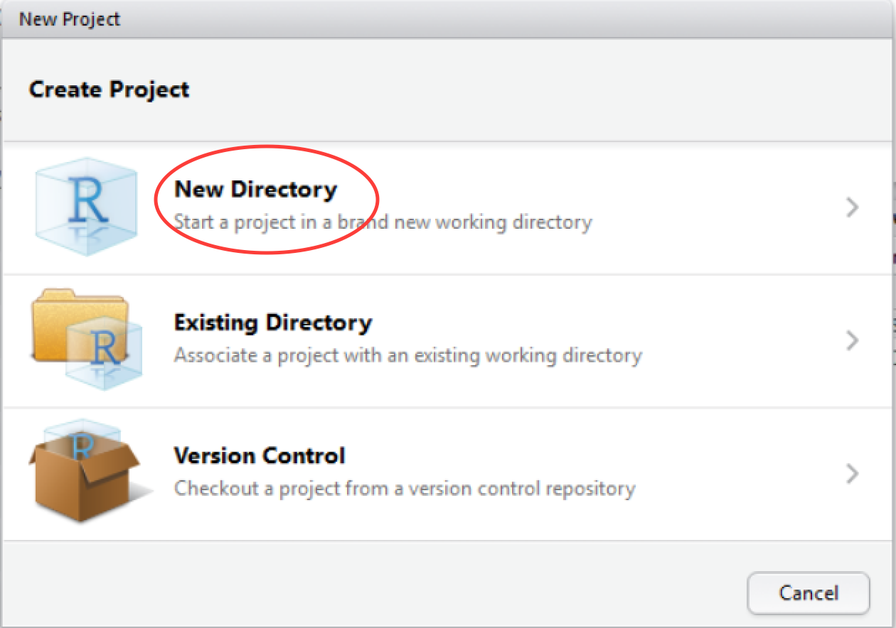
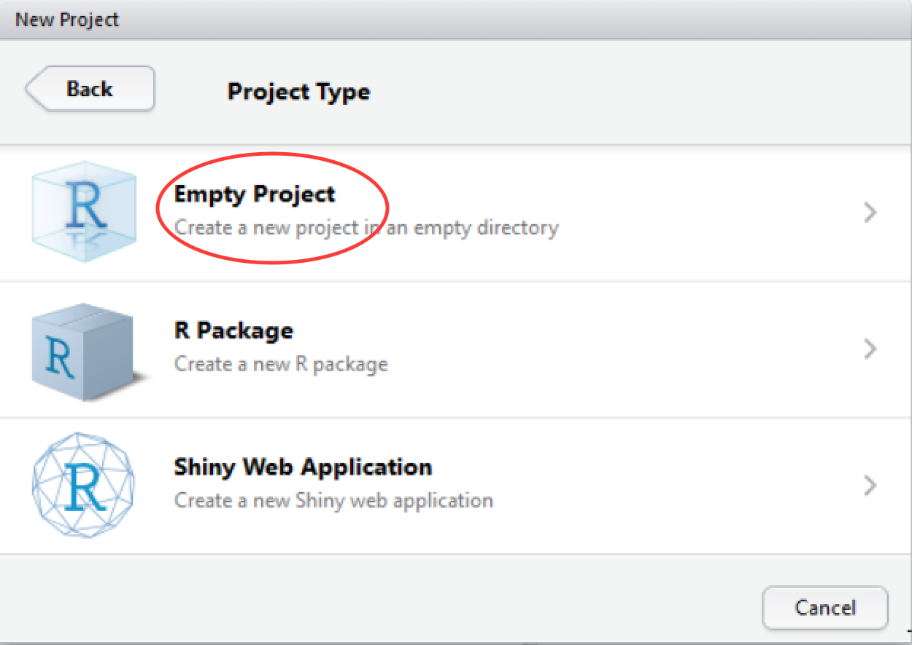
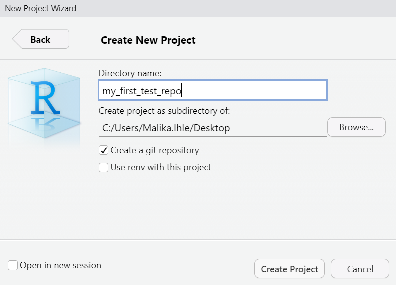
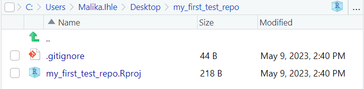

# Creating an RStudio project

A project is a folder that contains everything concerning your analysis and may include code, data and documentation. It is a complete research object that can be used to describe and reproduce your research.

Create a new project in RStudio as follows:

**File** -> **New Project** -> **New Directory**

 

In the **Project Type** screen, click on **Empty Project** or **New project**

 

In the **Create New Project** screen, give your project a name (e.g.'my_first_test_repo') and ensure that **create a git repository** is checked. Click on **Create Project**.

 

RStudio will create a new folder containing an empty project and set R's working directory to within it.

Two files are created in the otherwise empty project:

* **.gitignore** - Specifies files that should be ignored by the version control system (e.g. sensible data files that should not be made public, or documentation that you don't need version controlled).
* **my_first_test_repo.Rproj** - Configuration information for the RStudio project

There is no need to worry about the contents of either of these for the purposes of this tutorial.  

***

[Previous](./SSH.md) | [Next](./analysis_start.md)
