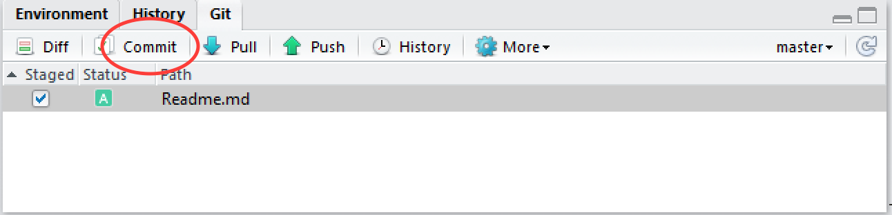
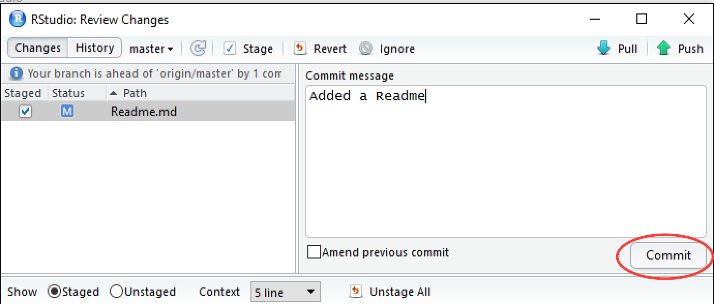
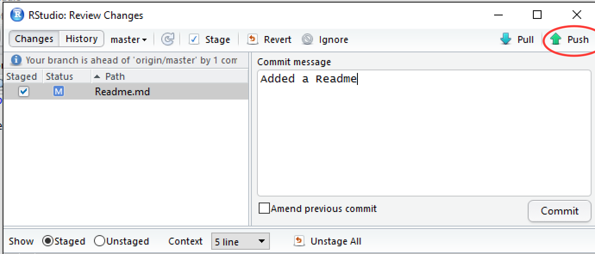

# Subsequent updates

Once a local repository has been associated with github, it's not necessary to use the command line for subsequent uploads. We'll demonstrate this now by adding a **README.md** file to our project.

On github, the README.md file is special since it is rendered by github and is used by many people as an introduction to the project.

In RStudio, click on **File->New File->Text File**.  Add the following text to the file and save it as **Readme.md**.

```
# My Example Repo

This repo is used to demonstrate github to users of R and R Studio.
```

In the **git** tab of RStudio, the **Readme.md** file should be the only file you see. Stage it as shown below and click **commit**.



Supply a commit message and click commit.



Finally, click **push** to upload to github.



You can see that the standard workflow loop is very quick and simple

* Make your change
* Stage your change
* Commit
* Push to github
