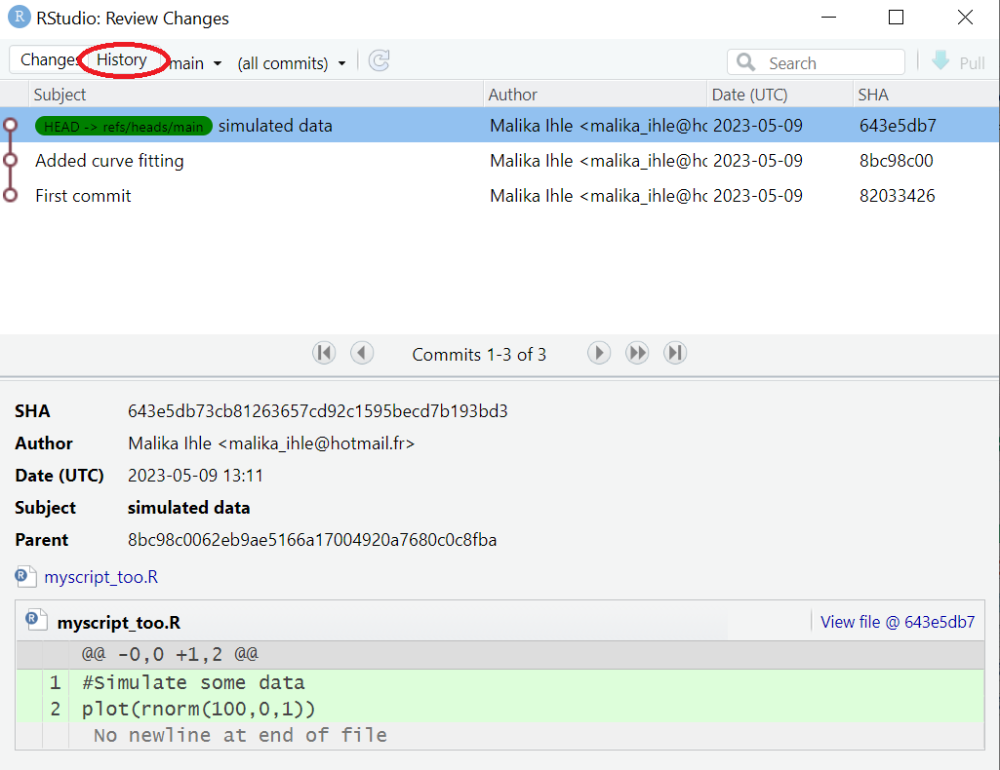
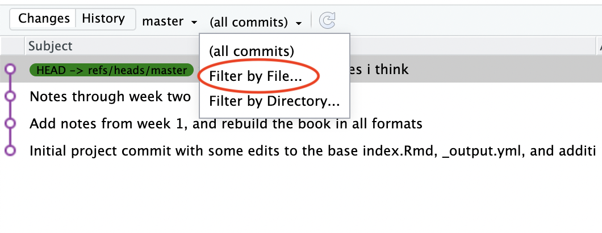
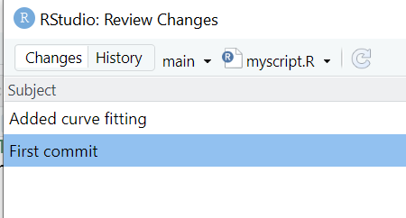

# Subsequent updates

Once a local repository has been associated with GitHub, it's not necessary to use the command line for subsequent uploads. We'll demonstrate this now by adding a **README.md** file to our project.

On GitHub, the README.md file is special since it is rendered by GitHub and is used by many people as an introduction to the project.

In RStudio, click on **File->New File->Text File**.  Add the following text to the file and save it as **Readme.md**.

```
# My Example Repo

This repo is used to demonstrate GitHub to users of R and R Studio.
```

In the **git** tab of RStudio, the **Readme.md** file should be the only file you see. Stage it as shown below and click **commit**.


Supply a commit message and click commit.


Finally, click **push** to upload to GitHub.


You can see that the standard workflow loop is very quick and simple

* Make your change
* Stage your change
* Commit
* Push to GitHub  

***

[Previous](./github_sync.md) | [Next](./created_earlier.md)


## Viewing History (Extension)


### Step 1 


As mentioned in the "Committing our Change" section of this tutorial, it is possible to look at your history of commits. By default, the history search feature will show all files added, changed, or deleted for each commit. However, it is often more practical to review the changes made to a single file over time; this enables, for example, clear tracking of the evolution of data cleaning and analysis steps in your project.

To access this within RStudio, press the **Diff** or **Commit** buttons. (Note that your available tabs may look slightly different, but you should find the Diff and Commit buttons under the **Git** tab.)


### Step 2

A window pane should pop up; press the **History** button.





### Step 3

To the right of the **History** button, there should now be a drop-down box titled `(all commits)`. Press this box to see the other options, which should be titled "Filter by File" and "Filter by Directory."


### Step 4

Select the **"Filter by File"** option.




### Step 5

A file-section window should appear on your screen; select the file you would like to review. 

The result should be similar to the image below which shows only the specific commits in which the selected file was included (i.e. when it was added, deleted, or edited). Click on any of the commit messages to view that specific commit, and scroll further down the screen to view changes made to the file during that commit.





