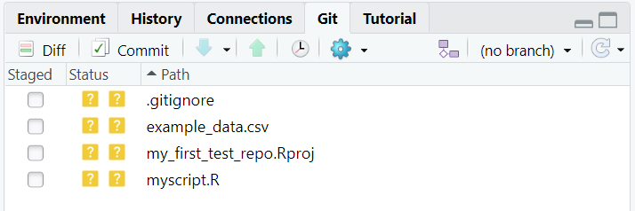
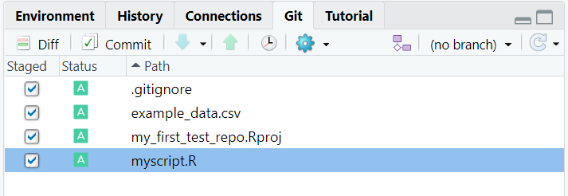
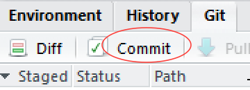
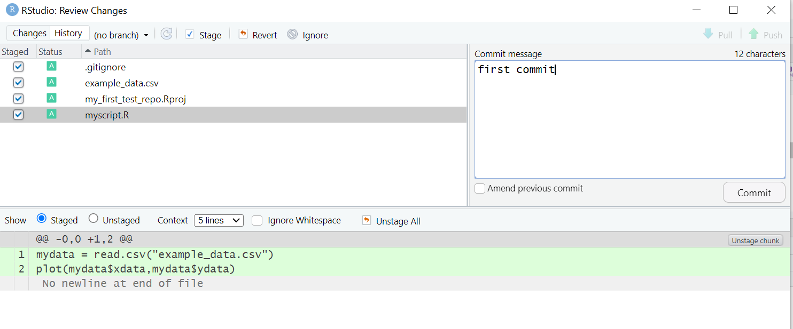
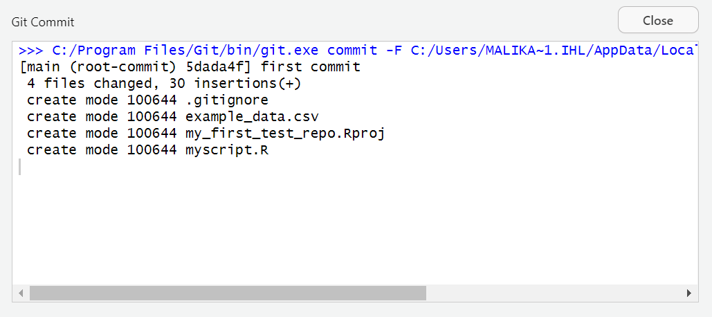

# Getting our project under version control

We now have the first version of our analysis so let's get it under version control. By default, the git version control pane is in the top right hand corner of RStudio. Find it and click on the **git** tab.

If you hover the mouse pointer over the yellow ? marks in github, you'll see a tooltip telling us that the file is **untracked**. This means that git is not tracking versions of this file.

Tick **staged** for each file.

All of our files are now **staged**, ready for the first **commit**. Click on the **commit** button

Details of the commit will appear in the next pane. You need to specifiy a **commit message** -- something descriptive about the changes you've made. Since this is our first commit, we'll follow tradition and call it **First Commit** 

Once you've typed a commit message, click on **Commit** and you're done.

The following messages from git will shown.

Click on **Close** and you are done.
