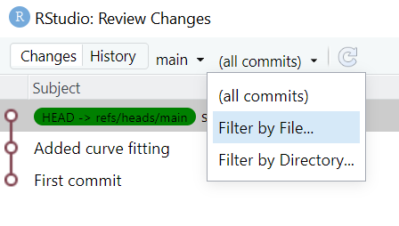

# Viewing history

In the **git** tab of RStudio, click on **Diff**  under the **Git** tab. 

A window pane should pop up; press the **History** button.

By default, the history search feature will show all files added, changed, or deleted for each commit. This can be extremely useful for finding bugs or looking back to how your project looked a few months ago. However, it is often more practical to review the changes made to a single file over time; this enables, for example, clear tracking of the evolution of data cleaning and analysis steps in your project.

To the right of the **History** button, there should now be a drop-down box titled `(all commits)`. Press this box to see the other options, which should be titled "Filter by File" and "Filter by Directory."

Select the **"Filter by File"** option.

A file-section window should appear on your screen; select the file you would like to review. 

The result should be similar to the image below which shows only the specific commits in which the selected file was included (i.e. when it was added, deleted, or edited). Click on any of the commit messages to view that specific commit, and scroll further down the screen to view changes made to the file during that commit.

It's not possible to revert back to a previous commit using the RStudio interface. For that, you need to learn some command-line git which is beyond the scope of this session. 

***

[Previous](./commit.md) | [Next](./github_sync.md)